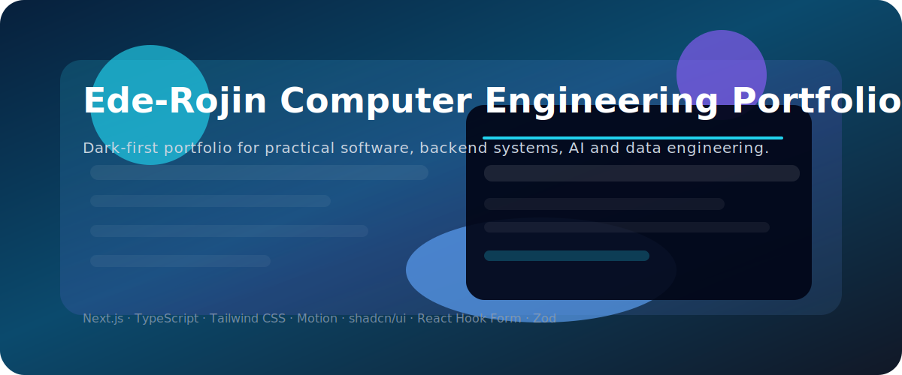

# Ede-Rojin Computer Engineering Portfolio



> A dark-first engineering portfolio for backend systems, AI/data work, and real product-ready code.

## Why this portfolio?

- **Practical case studies** that explain the problem, approach, and outcome.
- **Dark-first design** with light mode support, motion, and polished micro-interactions.
- **Engineering-focused storytelling** instead of just listing tools.

---

## What makes it feel alive?

1. **Animated hero text, aurora glow, and hover states**

2. **Scroll-reveal sections and parallax cards**

3. **Project cards with live previews, tech badges, and outcome summaries**

4. **Theme switcher with dark/light mode and glassmorphism**

---

## Visual and animation notes

### Görsel eklemek için

`README.md` içinde image eklemek için bu formatı kullanabilirsin:

```md

```

Eğer GIF veya küçük animasyon eklemek istersen:

```md

```

- `public/` klasörüne koyduğun görseller doğrudan `./public/...` yolu ile çalışır.
- `README.md` içindeki yol, proje kökünden (`README.md` ile aynı dizinden) başlayarak verilir.
- GIF kullanılınca GitHub, VS Code ve Vercel önizlemelerinde hareketli içerik desteklenir.

---

## Features

### Built for engineering clarity

- **Responsive pages**: Home, About, Projects, Project Detail, Contact
- **Theme toggle**: dark-first experience with polished light mode
- **Animated UI**: hero, scroll reveal, hover interactions, page transitions
- **Project library**: searchable, filterable, category-aware
- **Dynamic project routes**: `/projects/[slug]`

### Technical story

- **Project data** lives in `data/projects.ts`.
- **Motion animations** are handled through `motion/react`.
- **Validation** uses React Hook Form + Zod on the contact form.
- **SEO** includes metadata plus Open Graph/Twitter cards.

---

## Tech Stack

- Next.js 16 App Router
- React 19
- TypeScript
- Tailwind CSS 4
- shadcn/ui
- Lucide React
- Motion
- React Hook Form
- Zod

---

## Getting Started

```bash
npm install
npm run dev
```

Open your browser at `http://localhost:3000`.

---

## Quality Checks

```bash
npm run lint
npx tsc --noEmit
npm run build
```

---

## Deploy on Vercel

1. Push the repo to GitHub.
2. Import the repository on Vercel.
3. Use `Next.js` framework preset.
4. Build command: `npm run build`.
5. Share the live URL after deployment.
